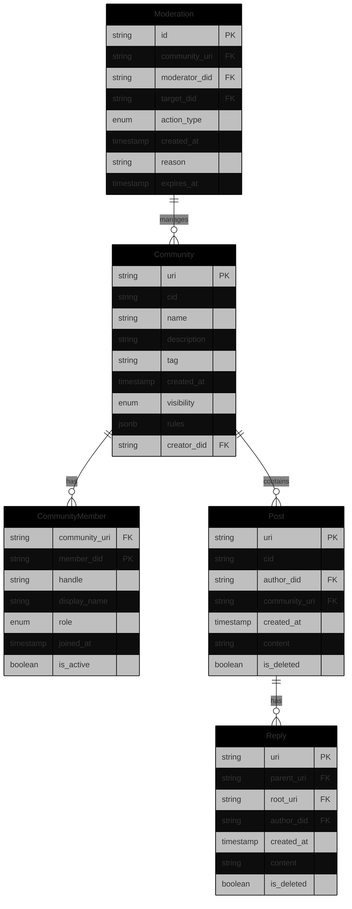
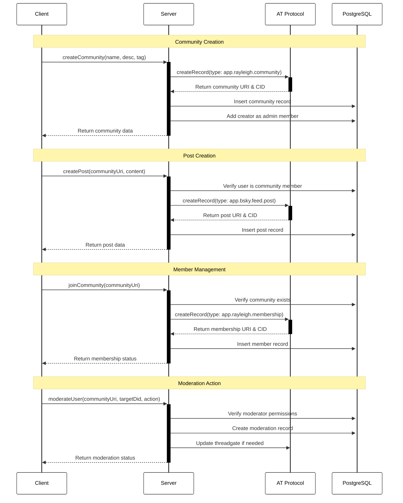
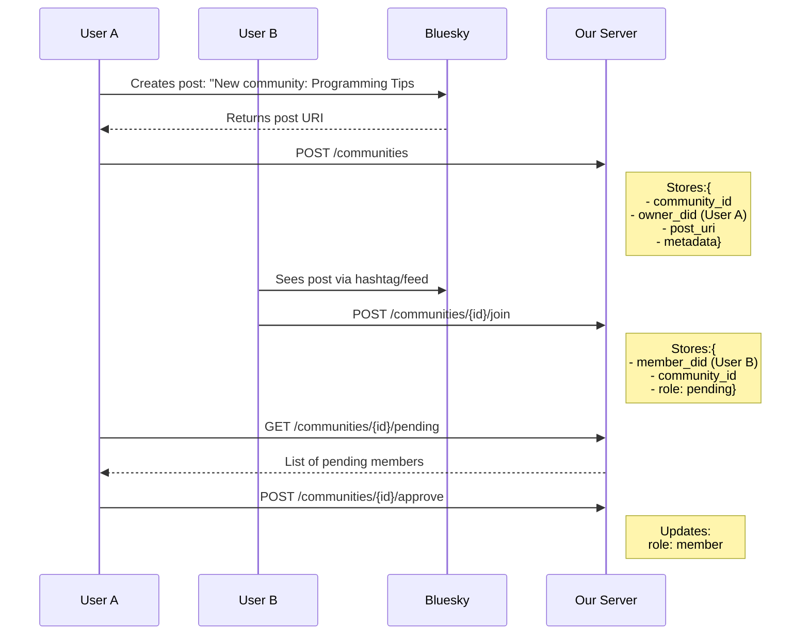

# AT Protocol Integration Design

This document outlines how Rayleigh integrates with the AT Protocol for community management.

## Core Entities

## Core Flows

## Key Concepts

1. **Communities**
   - Stored as AT Protocol records with type `app.rayleigh.community`
   - Core metadata in PostgreSQL for efficient querying
   - Rules and settings stored in JSONB for flexibility

2. **Membership**
   - Tracks community roles (member, moderator, admin)
   - Uses AT Protocol records for decentralized verification
   - PostgreSQL for fast member lookups and role checks

3. **Posts**
   - Leverages AT Protocol's native post system
   - Community association through custom fields
   - Local copy in PostgreSQL for community-specific queries

4. **Moderation**
   - Combines AT Protocol threadgate with local moderation records
   - Supports temporary and permanent actions
   - Audit trail in PostgreSQL

## Implementation Notes

1. **AT Protocol Records**
   - Communities and memberships are stored as AT Protocol records
   - Posts use standard Bluesky post format with community metadata
   - Custom lexicon defines community-specific fields

2. **PostgreSQL Usage**
   - Primary source for community metadata and relationships
   - Caches AT Protocol data for performance
   - Handles member roles and moderation actions

3. **Synchronization**
   - Firehose subscription keeps PostgreSQL in sync with AT Protocol
   - Background jobs handle temporary moderation expiry
   - Periodic validation ensures data consistency
